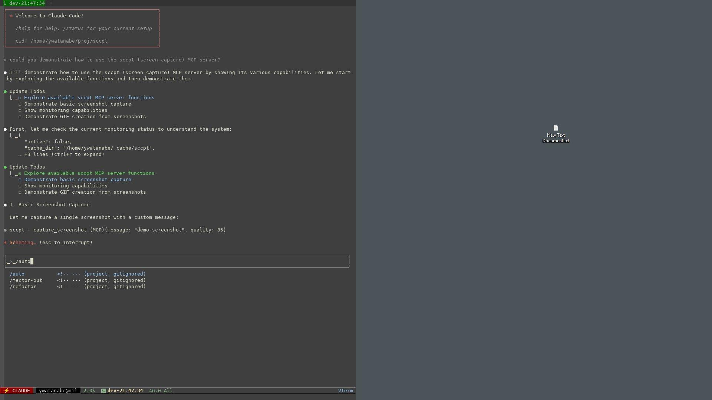
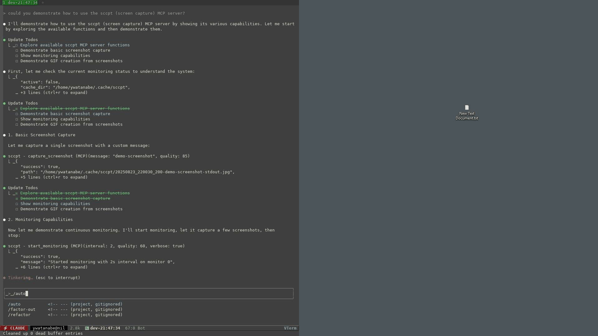
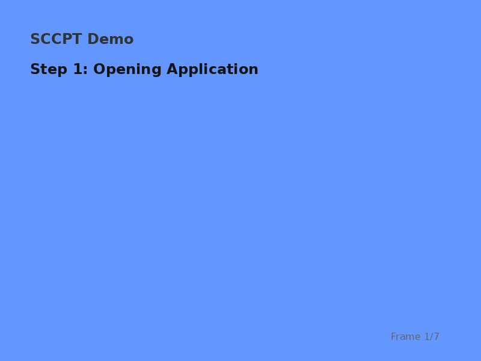
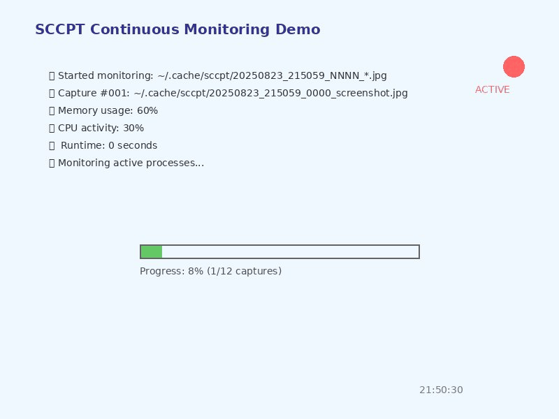
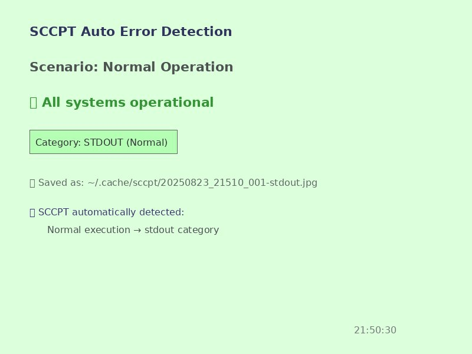

<!-- ---
!-- Timestamp: 2025-08-23 22:23:25
!-- Author: ywatanabe
!-- File: /home/ywatanabe/proj/sccpt/README.md
!-- --- -->

# SCCPT - Python Screen Capture with MCP Server Support
*- shared visual context between users and AI agents -*

A lightweight, efficient screen capture library with automatic error detection. **Features full MCP (Model Context Protocol) server integration for seamless AI assistant workflows.** Optimized for WSL2 to capture Windows host screens.

## Key Features

### 🤖 **MCP Server Integration** 
- **AI Assistant Ready** - Built-in MCP server for Claude Code and other AI assistants
- **Direct Screenshot Control** - AI can capture, monitor, and analyze screenshots programmatically
- **Automated Workflows** - Perfect for debugging, documentation, and monitoring tasks
- **Real-time Interaction** - AI assistants can respond to visual changes instantly

### 📸 **Core Screen Capture**
- 🖼️ **Windows Host Capture from WSL** - Seamlessly capture Windows desktop from WSL with DPI awareness
- 🖥️ **Multi-Monitor Support** - Capture single monitor or all monitors combined
- 🚨 **Automatic Error Detection** - Automatically categorizes screenshots when called in exception handlers
- 🗜️ **JPEG Compression** - Reduce file sizes with configurable quality (~250KB JPEG vs ~2MB PNG)

### 🎬 **Advanced Features**
- ⏱️ **Continuous Monitoring** - Automatic captures at configurable intervals (WSL: ~1.5s minimum due to PowerShell overhead)  
- 🎥 **GIF Summaries** - Create animated GIFs from monitoring sessions for easy sharing
- 📝 **Smart Filenames** - Timestamps + normalized messages + category indicators
- 🔄 **Thread-Safe** - Safe for concurrent operations
- 🎯 **Minimal Logging** - Clean, single-line output per screenshot

## Installation

```bash
pip install sccpt
# pip install sccpt[full] # For full features including mss and Pillow support:
```

## Quick Start

### 🐍 Python API - Beautiful Simplicity (Just 4 Functions)

```python
import sccpt

sccpt.cpt()                          # Capture single screenshot
sccpt.start()                        # Start monitoring  
sccpt.stop()                         # Stop monitoring
sccpt.create_gif_from_latest_session()  # Create GIF summary
```

### 🤖 MCP Server - AI Assistant Integration

```bash
# Start MCP server for Claude Code integration
python -m mcp_server_sccpt
```

*For complete setup instructions and available tools, see [MCP Server Integration](#-mcp-server-integration) section below.*

## Use Cases & Examples

### 📸 **Essential Use Cases**
- **Debug visually** - Capture before/after states during development  
- **Monitor processes** - Continuous screenshots during long operations
- **Document workflows** - Step-by-step visual documentation
- **Error analysis** - Automatic error categorization and screenshots
- **AI-powered automation** - Let AI assistants capture and analyze screens via MCP integration

<details>
<summary><strong>📋 Detailed Python Examples</strong></summary>

### 🐛 Debug Your Code Visually

```python
import sccpt

def process_data(df):
    sccpt.cpt("before transformation")
    df = df.transform(complex_operation)
    sccpt.cpt("after transformation")
    return df
```

### 🚨 Automatic Error Screenshots

```python
import sccpt

try:
    selenium_driver.click(button)
    api_response = fetch_data()
except Exception as e:
    sccpt.cpt()  # Auto-adds -stderr suffix
    raise
```

### 🔍 Monitor Long-Running Processes

```python
import sccpt

sccpt.start()  # Start taking screenshots every second
train_model()  # Your long operation
sccpt.stop()
```

### 🎬 Create GIF Summaries

```python
import sccpt

sccpt.start()
# ... your process ...  
sccpt.stop()
sccpt.create_gif_from_latest_session()
# 📹 GIF created: ~/.cache/sccpt/20250823_104523_summary.gif
```

</details>

## Platform Support

| Platform | Support | Notes |
|----------|---------|-------|
| **WSL → Windows** | ✅ Full | Primary focus - DPI-aware, multi-monitor |
| Linux (X11) | ⚠️ Limited | Falls back to mss/scrot |
| macOS | ⚠️ Limited | Requires mss library |
| Windows Native | ❌ | Not implemented |
| Linux (Wayland) | ❌ | Not supported |

<details>
<summary><strong>⚙️ Technical Details & Configuration</strong></summary>

## Configuration

All configuration through function parameters - no config files needed!

```python
sccpt.start(
    output_dir="~/screenshots",  # Where to save
    interval=2.0,                # Seconds between captures
    quality=85,                  # JPEG quality (1-100)
    verbose=False                # Silent mode
)
```

## File Structure

```
~/.cache/sccpt/
├── 20250823_104523-message-stdout.jpg    # Normal capture
├── 20250823_104525-error-stderr.jpg      # Error capture  
└── 20250823_104530_0001_*.jpg            # Monitoring mode

Cache automatically managed (1GB default limit, oldest files removed)
```

## Requirements

- Python 3.7+
- WSL environment (for Windows capture)
- PowerShell access to Windows host

Optional:
- `Pillow` - JPEG compression (recommended)
- `mss` - Cross-platform fallback

</details>

## 🤖 MCP Server Integration

**Transform your AI workflows** - SCCPT's MCP server enables Claude and other AI assistants to capture, monitor, and analyze screenshots directly as part of their reasoning process.

### AI-Powered Capabilities
- **Seamless Integration** - AI assistants can capture screenshots on demand
- **Automated Debugging** - AI captures error screens and analyzes issues  
- **Documentation Generation** - AI creates visual step-by-step guides
- **Intelligent Monitoring** - AI watches for visual changes and responds
- **Error Analysis** - AI automatically categorizes and analyzes screenshots

<details>
<summary><strong>🔧 MCP Server Setup & Configuration</strong></summary>

### Setup

```json
// Add to your Claude Code settings
{
  "mcpServers": {
    "sccpt": {
      "command": "python", 
      "args": ["/path/to/sccpt/mcp_server_sccpt.py"]
    }
  }
}
```

### Available MCP Tools

**Core Capture:**
- `capture_screenshot` - Take single screenshots with custom messages
- `start_monitoring` / `stop_monitoring` - Continuous monitoring at configurable intervals
- `get_monitoring_status` - Check current monitoring status

**Analysis & Management:**
- `analyze_screenshot` - AI-powered error detection and categorization
- `list_recent_screenshots` - Browse capture history by category (stdout/stderr)
- `clear_cache` - Manage screenshot cache size

**Advanced Features:**
- `create_gif` - Generate animated summaries from monitoring sessions
- `list_sessions` - List available sessions for GIF creation

</details>

## 🎬 Live Demos & Screenshots

### 📸 Single Screenshot Capture

*Example of SCCPT's single screenshot capture functionality with custom message*

### 🔄 Real Monitoring Session

*Real GIF created from an actual monitoring session showing SCCPT's continuous capture capabilities*

**Real Session Details:**
- **Duration**: 30 seconds monitoring interval  
- **Screenshots**: 11 captures automatically taken
- **File Size**: 2.8MB optimized GIF
- **Quality**: Automatic JPEG compression for efficient storage
- **Features Demonstrated**: 
  - Automatic timestamp-based naming
  - Session-based organization
  - GIF creation from monitoring sessions

## 🎥 Professional Feature Demonstrations

### 📋 Complete Workflow Documentation

*Step-by-step workflow documentation showing how SCCPT captures each stage of a process (230KB, 7 frames)*

### 🖥️ Continuous Monitoring Visualization

*Professional demonstration of SCCPT's continuous monitoring with real-time progress tracking (429KB, 12 frames)*

### 🚨 Automatic Error Detection

*Shows how SCCPT automatically categorizes screenshots as stdout (normal) vs stderr (error) based on execution context (322KB, 5 frames)*

## License

MIT License

## Contributing

Contributions are welcome! Please feel free to submit a Pull Request.

## Contact
Yusuke.Watanabe@scitex.ai

<!-- EOF -->